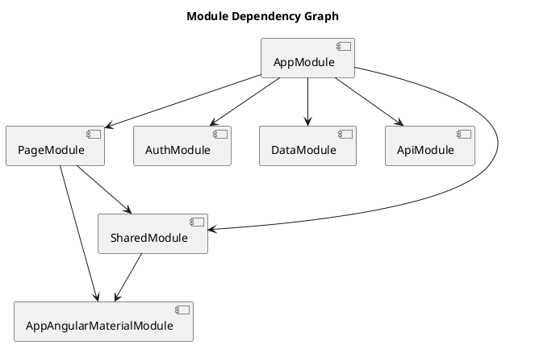

# Journalogy Frontend

## Project Structure
```
Journalogy.Frontend/
|-- .gitignore
|-- angular.json
|-- package.json
|-- tsconfig.json
|-- src/
    |-- index.html
    |-- main.ts
    |-- polyfills.ts
    |-- styles.scss
    |-- app/
        |-- auth/
            |-- auth.module.ts
            |-- auth.service.ts
            |-- auth.interceptor.ts
        |-- data/
            |-- index.ts
            |-- ... 
        |-- api/
            |-- api.module.ts
            |-- ...
        |-- page/
            |-- home/
                |-- home.component.ts
                |-- home.component.html
                |-- home.component.scss
        |-- shared/
            |-- sidenav/
                |-- sidenav.component.ts
                |-- sidenav.component.html
                |-- sidenav.component.scss
            |-- top-navbar/
                |-- top-navbar.component.ts
                |-- top-navbar.component.html
                |-- top-navbar.component.scss
            |-- shared.module.ts
        |-- app-routing.module.ts
        |-- app-angular-material.module.ts
        |-- app.component.ts
        |-- app.module.ts
```

## Overview:
This is an Angular frontend built with Angular version 14. It includes HTTP client services for API interaction and authentication services utilizing Auth0.

## Project Description:
This frontend application allows users to interact with the Journalogy web service. It displays user and journal entry information and integrates with a backend service to manage data collaboratively.

## Local Development URL:
Use the following URL to run the frontend locally: [http://localhost:4200](http://localhost:4200)

## Features:
- Angular application with a structured component and service-based architecture.
- Integration with Auth0 for authentication and authorization.
- HTTP interceptors to attach bearer tokens to API requests.
- Responsive design using SCSS.
- Angular Material for UI components including table, sort, paginator, etc.
- Collapsible sidenav with dynamic routing and layout.

## Modules:
- **PageModule:** Contains components related to app pages.
- **AuthModule:** Contains authentication services and guards.
- **DataModule:** Manages data models and structure.
- **ApiModule:** Contains services for API communication.
- **SharedModule:** Houses reusable components like top-navbar and sidenav.
- **AppAngularMaterialModule:** Bundles commonly used Angular Material components.

## Components:
- **HomeComponent:** Displays a list of users fetched from the backend, uses Angular Material table with pagination.
- **TopNavbarComponent:** Provides navigation and search functionality.
- **SidenavComponent:** Collapsible sidebar navigation.

## Design Workflow

### Services
- Services within ApiModule handle CRUD operations for interacting with backend endpoints.
- Use of RxJS observables for async data fetching and manipulation.

### Auth Integration
- Auth0 authentication with secured routes using AuthGuards.
- Interceptor to automatically attach JWT tokens to HTTP requests.

## Dependency Management
- Managed via `package.json` with dependencies like `@angular/core`, `rxjs`, `@auth0/auth0-angular`, `@angular/material` etc.

## Environment Setup
- Ensure Node.js and npm are installed.
- Install dependencies using `npm install`.

## Build & Development
- Run `ng serve` to launch the application.
- Use Angular CLI for building and developing the application.

## Troubleshooting
- In case of CORS issues, ensure the backend API is configured to accept requests from `http://localhost:4200`.
- Auth0 configuration must match the setup in both frontend and backend apps to ensure smooth authentication flow.

## Pages
- **Home Page**:
  - Display a table with active vacations including the names of participants and descriptions.
  - An activity feed showing journal entries sorted from newest to oldest.
  - Features a button to allow user responses to journal entries.
- **Vacations Page**:
  - List of vacations.
  - Filter by vacation status and a search field.
  - Edit button for vacations with modal for adding participants and updating info.

## Module Dependency Graph


## Next Steps
- Implement unit testing for other services and components to improve code reliability.
- Integrate internationalization for multilingual support based on user locations.
- Optimize performance by lazy-loading modules and reducing bundle sizes.

**Questions for Michael:**
- Are there any additional authentication features or flows to be considered?
- Any specific user interface or branding elements you would like to see implemented?
- Shall we integrate real-time data features like WebSockets for the activity feed?

## Context & Continuation
- **Current Focus:** We are focusing on integrating modals for creating and editing vacations, ensuring data is handled through API interactions, and optimizing user experiences with loading spinners.
- **Outstanding Tasks:** Complete the integration of real-time data updates if needed, finalize UI/UX designs for the application, and ensure all routes and navigations are user-friendly.
- **Notes:** This application connects to the Journalogy backend, facilitating collaborative journaling during vacations with real-time updates and intuitive design.

### Important Directories
- **Frontend:** `C:\Users\mhmoo\source\repos\TurkProjects\Journalogy.Frontend`
- **Backend:** `C:\Users\mhmoo\source\repos\TurkProjects\Journalogy.Backend`
- **Swagger JSON Definition:** Accessible via [https://localhost:7183/swagger/v1/swagger.json](https://localhost:7183/swagger/v1/swagger.json)

**Notes:**
- Refer to the backend documentation for API details and integration guidelines.
- This application will connect with Journalogy backend to provide a seamless journaling experience.